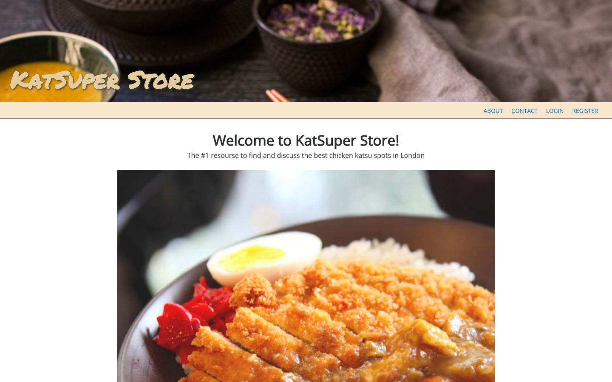
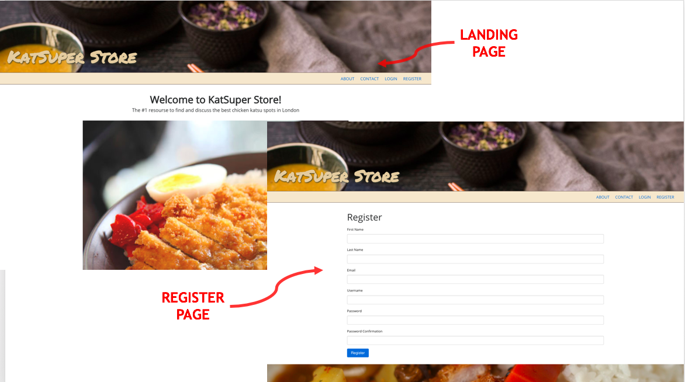
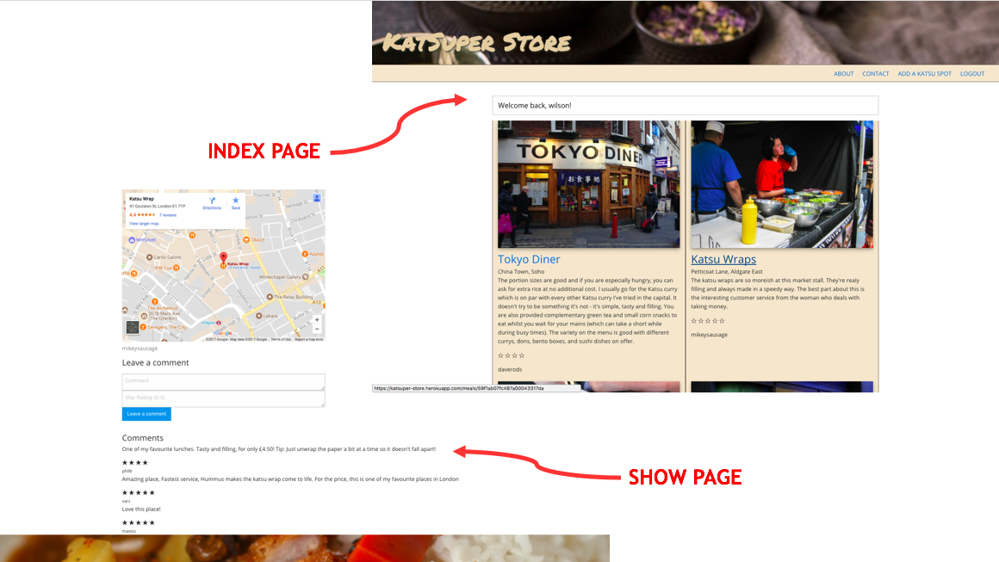

#  WDI Project 2: RESTful app with authentication  - ‘KatSuper Store’

**[https://katsuper-store.herokuapp.com/](https://katsuper-store.herokuapp.com//)**

## SUMMARY

My final project at General Assembly was to create a full MERN stac.................

Within project two, I created my first fully RESTful application with backend authentication using Express.js Sessions. This project was my first opportunity to get to grips with an application that demonstrated the create, read update, delete (CRUD) functionality found in most websites. In this project, I used embedded JavaScript (EJS) to create views rendered on the browser to display information on the best katsu curry locations in London.

### Programming and Technology Library:

* Mongo, Express, Node.js
* JavaScript
* HTML5
* CSS3
* SASS
* EJS
* express-session
* morgan
* express-ejs-layouts
* body-parser
* express-flash
* bluebird

## PLANNING

## FEATURES

## LESSONS LEARNED
1. 

## FEATURES BACKLOG
1. 