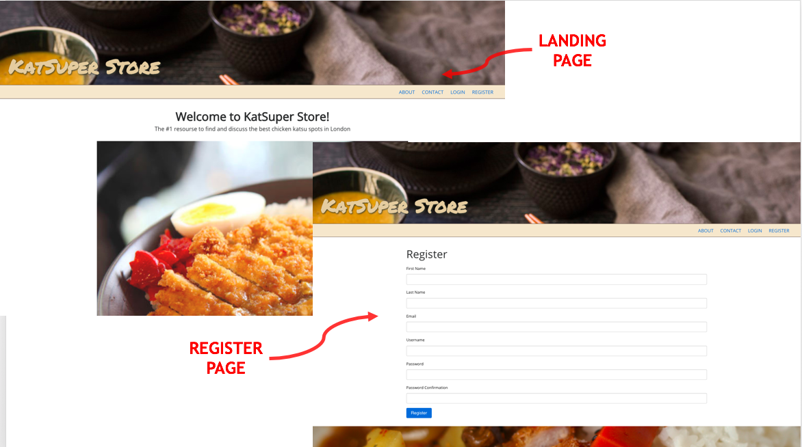
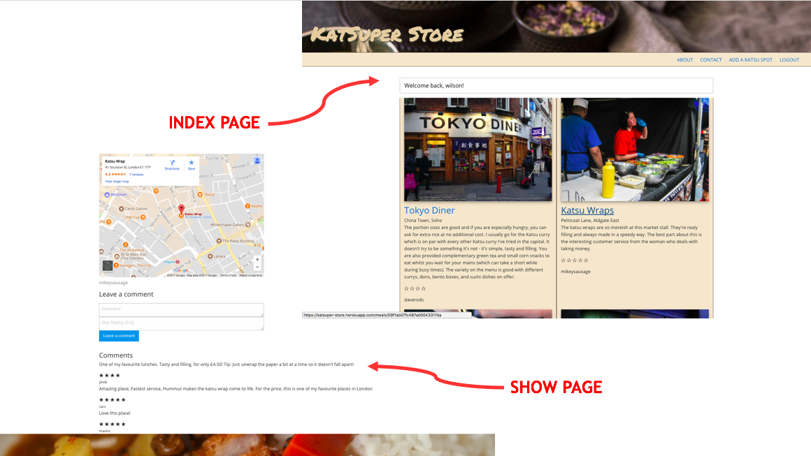
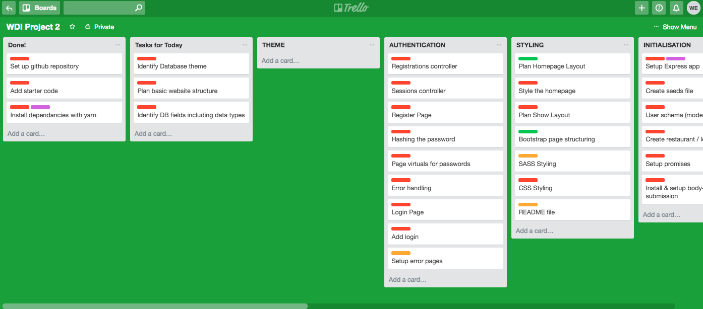

#  WDI Project 2: RESTful app with authentication  - ‘KatSuper Store’

**[https://katsuper-store.herokuapp.com/](https://katsuper-store.herokuapp.com//)**

## SUMMARY

For my second major project at GA, I created my first fully RESTful application with backend authentication using Express.js Sessions. This project was my first opportunity to get to grips with an application that demonstrated the create, read update, delete (CRUD) functionality found in most websites.

During the course at GA, my course mates and I often got food from a local food market near the campus. One particular Japanese Katsu wrap stall stood out and in tribute to that stall I chose to create site all about the best Katsu spot in London. The app uses embedded JavaScript (EJS) to render views in the browser and users can add, rate and comment on their favourite katsu curry places.

### Programming and Technology Library:

* Mongo, Express, Node.js
* JavaScript
* HTML5
* CSS3
* SASS
* EJS
* express-session
* morgan
* express-ejs-layouts
* body-parser
* express-flash
* bluebird

## STYLING

Having looked for inspiration from other food based websites, I noticed that

> Figure 1 -

> Figure 2 -

## PLANNING

> Figure 3 -

## FEATURES
### Authentication
sessions

### Average Rating
backend fucntionality

### Comments
create and delete

## LESSONS LEARNED
1.

## FEATURES BACKLOG
1.
